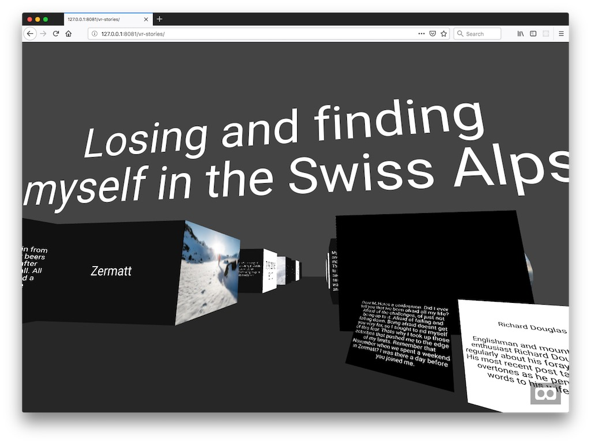

# vr-headless-demo

## A demonstration of a VR experience with content managed in Magnolia CMS.


## Features

Uses A-FRAME (https://aframe.io/) to create a VR experience with content from the Magnolia Stories App.

Different block types from the story will be rendered as different 3D elements. In this version, the story is presented as if it were a museum installation.



On a desktop computer, you can use the arrow keys to move through the environment.

Click on the glasses icon in the lower right corner to enter full VR mode.

Tested on desktop Chrome & Firefox, mobile Chrome & Firefox, and Oculus browser on the Oculus Go.

Uses the delivery endpoint: https://documentation.magnolia-cms.com/display/DOCS57/Delivery+endpoint+API

## Installation

Note that this version is compatible with Magnolia version 5.7 & 6.0

The files in the `vr-stories` directory are the full VR experience which can be run on any http server.

The `vr-stories-lm` directory is a Magnolia `Light Module` which provisions the REST endpoint
that the VR client expects.
To use it on your own Magnolia instance, just drop `vr-stories-lm` into your resources directory - usually named `modules` or `light-modules`.

### CORS

The VR client also requires XHR access to image assets on the Magnolia server. CORS must be configured properly with a filter for this to work, in the Configuration app, under `server/filters`. If your server configuration already has an addCORSHeaders entry, you can just make the folowing changes.
```
addCORSHeaders
  bypasses
    byPassForAllExceptRestAndImages
      class: info.magnolia.voting.voters.URIRegexVoter
      not: true
      pattern: ^\/(\.imaging|\.rest|dam)\/(.*)

```
Otherwise you can use the `Import` action to import the `_dev/cors/config.server.filters.addCORSHeaders.xml` configuration bootstrap file from this repository. Be sure to place the filter directly after the `server/filters/uriSecurity` filter.

### Sample Content and s parameter

The VR client assumes that the Magnolia Travel Demo installed, and opens the `stories-demo/lost-and-found-in-swiss-alps` story by default. But you can specify the path to any story with the `s` parameter on the querystring (index.html?s=my-stories/went-to-seveneleven)

## Information on Magnolia CMS
https://documentation.magnolia-cms.com

## License

MIT

## Contributors

Magnolia, https://magnolia-cms.com

Christopher Zimmermann, @topherzee
